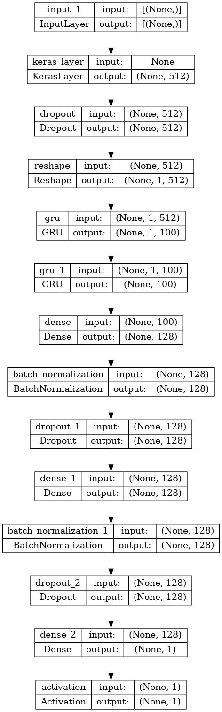

# CNN Cancer Detection

This is the 4th week assignment in CU Boulder intro deep learning class.

We utilize transfer learning, `universal sentence encoder`  as feature extraction, to classify whether twitter text is about disaster or not.

We assume this notebook runs on kaggle notebook. The original kaggle competision is [here](https://www.kaggle.com/competitions/nlp-getting-started). You can get the same dataset as we use from competision page.

### Files and Folders
* [nlp.ipynb](./nlp.ipynb): Jupyter Notebook containing the data analysis and model building code

### Prerequisite

* Kaggle account
* Dataset. downloadable from [this link](https://www.kaggle.com/competitions/nlp-getting-started/data)

### Model Structure

We utilize transfear learning with universal sentence condeer as feature extration embedding layers. On top of that embedding, we put som RNN and Dense layers to classify the tweeets.

Dataflows are like this:

1. Feed text data without preprocessing
2. Embed sentence by pretrained model, universal sentence encoder
3. Go through 2 GRU RNN layers
4. Go through 2 FCC Dense layers
5. Output sigmoid activated value

### Results

The model's final score would be about 0.8 in f-1 score.